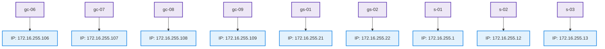

## Group-to-Host Mapping

```mermaid
flowchart
  classDef groupStyle fill:#f8f8f8,stroke:#888,stroke-width:1.5px;
  classDef hostStyle fill:#ede7f6,stroke:#5e35b1,stroke-width:2px;
  gpu_client["gpu_client"]:::groupStyle --> gc-06["gc-06"]:::hostStyle
  gpu_client["gpu_client"]:::groupStyle --> gc-07["gc-07"]:::hostStyle
  gpu_client["gpu_client"]:::groupStyle --> gc-08["gc-08"]:::hostStyle
  managed["managed"]:::groupStyle --> gc-08["gc-08"]:::hostStyle
  gpu_client["gpu_client"]:::groupStyle --> gc-09["gc-09"]:::hostStyle
  test_group["test_group"]:::groupStyle --> gc-09["gc-09"]:::hostStyle
  gpu_server["gpu_server"]:::groupStyle --> gs-01["gs-01"]:::hostStyle
  gpu_server["gpu_server"]:::groupStyle --> gs-02["gs-02"]:::hostStyle
  test_group["test_group"]:::groupStyle --> gs-02["gs-02"]:::hostStyle
  openvpn_host["openvpn_host"]:::groupStyle --> s-01["s-01"]:::hostStyle
  base_server["base_server"]:::groupStyle --> s-01["s-01"]:::hostStyle
  under_development["under_development"]:::groupStyle --> s-02["s-02"]:::hostStyle
  base_server["base_server"]:::groupStyle --> s-02["s-02"]:::hostStyle
  base_server["base_server"]:::groupStyle --> s-03["s-03"]:::hostStyle
  test_group["test_group"]:::groupStyle --> s-03["s-03"]:::hostStyle
```
# Host-to-Group Mapping

```mermaid
flowchart
  classDef hostStyle fill:#ede7f6,stroke:#5e35b1,stroke-width:2px;
  classDef groupStyle fill:#f8f8f8,stroke:#888,stroke-width:1.5px;
  gc-06["gc-06"]:::hostStyle --> gpu_client["gpu_client"]:::groupStyle
  gc-07["gc-07"]:::hostStyle --> gpu_client["gpu_client"]:::groupStyle
  gc-08["gc-08"]:::hostStyle --> gpu_client["gpu_client"]:::groupStyle
  gc-08["gc-08"]:::hostStyle --> managed["managed"]:::groupStyle
  gc-09["gc-09"]:::hostStyle --> gpu_client["gpu_client"]:::groupStyle
  gc-09["gc-09"]:::hostStyle --> test_group["test_group"]:::groupStyle
  gs-01["gs-01"]:::hostStyle --> gpu_server["gpu_server"]:::groupStyle
  gs-02["gs-02"]:::hostStyle --> gpu_server["gpu_server"]:::groupStyle
  gs-02["gs-02"]:::hostStyle --> test_group["test_group"]:::groupStyle
  s-01["s-01"]:::hostStyle --> openvpn_host["openvpn_host"]:::groupStyle
  s-01["s-01"]:::hostStyle --> base_server["base_server"]:::groupStyle
  s-02["s-02"]:::hostStyle --> under_development["under_development"]:::groupStyle
  s-02["s-02"]:::hostStyle --> base_server["base_server"]:::groupStyle
  s-03["s-03"]:::hostStyle --> base_server["base_server"]:::groupStyle
  s-03["s-03"]:::hostStyle --> test_group["test_group"]:::groupStyle
```

## Host-to-Role Mapping

```mermaid
flowchart TB
  classDef hostStyle fill:#ede7f6,stroke:#5e35b1,stroke-width:2px;
  classDef roleStyleLevel1 fill:#ffebee,stroke:#d32f2f,stroke-width:2px;
  classDef roleStyleLevel2 fill:#e3f2fd,stroke:#0288d1,stroke-width:2px;
  classDef roleStyleLevel3 fill:#e8f5e9,stroke:#388e3c,stroke-width:2px;
  classDef roleStyleLevel4 fill:#fff9c4,stroke:#f9a825,stroke-width:2px;
  gc-06["gc-06"]:::hostStyle
  RoleCount_gc-06{"7 roles"}:::roleStyleLevel1
  gc-06 --> RoleCount_gc-06
  RoleCount_gc-06_custom_packages["custom_packages"]:::roleStyleLevel1
  RoleCount_gc-06 --> RoleCount_gc-06_custom_packages
  RoleCount_gc-06_custom_packages_cuda["cuda"]:::roleStyleLevel2
  RoleCount_gc-06_custom_packages --> RoleCount_gc-06_custom_packages_cuda
  RoleCount_gc-06_custom_packages_visuals["visuals"]:::roleStyleLevel2
  RoleCount_gc-06_custom_packages --> RoleCount_gc-06_custom_packages_visuals
  RoleCount_gc-06_custom_packages_videoEditing["videoEditing"]:::roleStyleLevel2
  RoleCount_gc-06_custom_packages --> RoleCount_gc-06_custom_packages_videoEditing
  RoleCount_gc-06_custom_packages_office["office"]:::roleStyleLevel2
  RoleCount_gc-06_custom_packages --> RoleCount_gc-06_custom_packages_office
  RoleCount_gc-06_custom_packages_baseDevelopment["baseDevelopment"]:::roleStyleLevel2
  RoleCount_gc-06_custom_packages --> RoleCount_gc-06_custom_packages_baseDevelopment
  RoleCount_gc-06_aglnet["aglnet"]:::roleStyleLevel1
  RoleCount_gc-06 --> RoleCount_gc-06_aglnet
  RoleCount_gc-06_aglnet_client["client"]:::roleStyleLevel2
  RoleCount_gc-06_aglnet --> RoleCount_gc-06_aglnet_client
  RoleCount_gc-06_aglnet_client_enable["enable"]:::roleStyleLevel3
  RoleCount_gc-06_aglnet_client --> RoleCount_gc-06_aglnet_client_enable
  RoleCount_gc-06_endoreg_client["endoreg_client"]:::roleStyleLevel1
  RoleCount_gc-06 --> RoleCount_gc-06_endoreg_client
  RoleCount_gc-06_endoreg_client_enable["enable"]:::roleStyleLevel2
  RoleCount_gc-06_endoreg_client --> RoleCount_gc-06_endoreg_client_enable
  gc-07["gc-07"]:::hostStyle
  RoleCount_gc-07{"2 roles"}:::roleStyleLevel1
  gc-07 --> RoleCount_gc-07
  RoleCount_gc-07_aglnet["aglnet"]:::roleStyleLevel1
  RoleCount_gc-07 --> RoleCount_gc-07_aglnet
  RoleCount_gc-07_aglnet_client["client"]:::roleStyleLevel2
  RoleCount_gc-07_aglnet --> RoleCount_gc-07_aglnet_client
  RoleCount_gc-07_aglnet_client_enable["enable"]:::roleStyleLevel3
  RoleCount_gc-07_aglnet_client --> RoleCount_gc-07_aglnet_client_enable
  RoleCount_gc-07_endoreg_client["endoreg_client"]:::roleStyleLevel1
  RoleCount_gc-07 --> RoleCount_gc-07_endoreg_client
  RoleCount_gc-07_endoreg_client_enable["enable"]:::roleStyleLevel2
  RoleCount_gc-07_endoreg_client --> RoleCount_gc-07_endoreg_client_enable
  gc-08["gc-08"]:::hostStyle
  RoleCount_gc-08{"6 roles"}:::roleStyleLevel1
  gc-08 --> RoleCount_gc-08
  RoleCount_gc-08_custom_packages["custom_packages"]:::roleStyleLevel1
  RoleCount_gc-08 --> RoleCount_gc-08_custom_packages
  RoleCount_gc-08_custom_packages_dev03["dev03"]:::roleStyleLevel2
  RoleCount_gc-08_custom_packages --> RoleCount_gc-08_custom_packages_dev03
  RoleCount_gc-08_custom_packages_cuda["cuda"]:::roleStyleLevel2
  RoleCount_gc-08_custom_packages --> RoleCount_gc-08_custom_packages_cuda
  RoleCount_gc-08_custom_packages_office["office"]:::roleStyleLevel2
  RoleCount_gc-08_custom_packages --> RoleCount_gc-08_custom_packages_office
  RoleCount_gc-08_custom_packages_baseDevelopment["baseDevelopment"]:::roleStyleLevel2
  RoleCount_gc-08_custom_packages --> RoleCount_gc-08_custom_packages_baseDevelopment
  RoleCount_gc-08_aglnet["aglnet"]:::roleStyleLevel1
  RoleCount_gc-08 --> RoleCount_gc-08_aglnet
  RoleCount_gc-08_aglnet_client["client"]:::roleStyleLevel2
  RoleCount_gc-08_aglnet --> RoleCount_gc-08_aglnet_client
  RoleCount_gc-08_aglnet_client_enable["enable"]:::roleStyleLevel3
  RoleCount_gc-08_aglnet_client --> RoleCount_gc-08_aglnet_client_enable
  RoleCount_gc-08_endoreg_client["endoreg_client"]:::roleStyleLevel1
  RoleCount_gc-08 --> RoleCount_gc-08_endoreg_client
  RoleCount_gc-08_endoreg_client_enable["enable"]:::roleStyleLevel2
  RoleCount_gc-08_endoreg_client --> RoleCount_gc-08_endoreg_client_enable
  gc-09["gc-09"]:::hostStyle
  RoleCount_gc-09{"2 roles"}:::roleStyleLevel1
  gc-09 --> RoleCount_gc-09
  RoleCount_gc-09_aglnet["aglnet"]:::roleStyleLevel1
  RoleCount_gc-09 --> RoleCount_gc-09_aglnet
  RoleCount_gc-09_aglnet_client["client"]:::roleStyleLevel2
  RoleCount_gc-09_aglnet --> RoleCount_gc-09_aglnet_client
  RoleCount_gc-09_aglnet_client_enable["enable"]:::roleStyleLevel3
  RoleCount_gc-09_aglnet_client --> RoleCount_gc-09_aglnet_client_enable
  RoleCount_gc-09_endoreg_client["endoreg_client"]:::roleStyleLevel1
  RoleCount_gc-09 --> RoleCount_gc-09_endoreg_client
  RoleCount_gc-09_endoreg_client_enable["enable"]:::roleStyleLevel2
  RoleCount_gc-09_endoreg_client --> RoleCount_gc-09_endoreg_client_enable
  gs-01["gs-01"]:::hostStyle
  RoleCount_gs-01{"3 roles"}:::roleStyleLevel1
  gs-01 --> RoleCount_gs-01
  RoleCount_gs-01_aglnet["aglnet"]:::roleStyleLevel1
  RoleCount_gs-01 --> RoleCount_gs-01_aglnet
  RoleCount_gs-01_aglnet_client["client"]:::roleStyleLevel2
  RoleCount_gs-01_aglnet --> RoleCount_gs-01_aglnet_client
  RoleCount_gs-01_aglnet_client_enable["enable"]:::roleStyleLevel3
  RoleCount_gs-01_aglnet_client --> RoleCount_gs-01_aglnet_client_enable
  RoleCount_gs-01_base_server["base-server"]:::roleStyleLevel1
  RoleCount_gs-01 --> RoleCount_gs-01_base_server
  RoleCount_gs-01_base_server_enable["enable"]:::roleStyleLevel2
  RoleCount_gs-01_base_server --> RoleCount_gs-01_base_server_enable
  RoleCount_gs-01_endoreg_client["endoreg_client"]:::roleStyleLevel1
  RoleCount_gs-01 --> RoleCount_gs-01_endoreg_client
  RoleCount_gs-01_endoreg_client_enable["enable"]:::roleStyleLevel2
  RoleCount_gs-01_endoreg_client --> RoleCount_gs-01_endoreg_client_enable
  gs-02["gs-02"]:::hostStyle
  RoleCount_gs-02{"3 roles"}:::roleStyleLevel1
  gs-02 --> RoleCount_gs-02
  RoleCount_gs-02_aglnet["aglnet"]:::roleStyleLevel1
  RoleCount_gs-02 --> RoleCount_gs-02_aglnet
  RoleCount_gs-02_aglnet_client["client"]:::roleStyleLevel2
  RoleCount_gs-02_aglnet --> RoleCount_gs-02_aglnet_client
  RoleCount_gs-02_aglnet_client_enable["enable"]:::roleStyleLevel3
  RoleCount_gs-02_aglnet_client --> RoleCount_gs-02_aglnet_client_enable
  RoleCount_gs-02_base_server["base-server"]:::roleStyleLevel1
  RoleCount_gs-02 --> RoleCount_gs-02_base_server
  RoleCount_gs-02_base_server_enable["enable"]:::roleStyleLevel2
  RoleCount_gs-02_base_server --> RoleCount_gs-02_base_server_enable
  RoleCount_gs-02_endoreg_client["endoreg_client"]:::roleStyleLevel1
  RoleCount_gs-02 --> RoleCount_gs-02_endoreg_client
  RoleCount_gs-02_endoreg_client_enable["enable"]:::roleStyleLevel2
  RoleCount_gs-02_endoreg_client --> RoleCount_gs-02_endoreg_client_enable
  s-01["s-01"]:::hostStyle
  RoleCount_s-01{"4 roles"}:::roleStyleLevel1
  s-01 --> RoleCount_s-01
  RoleCount_s-01_aglnet["aglnet"]:::roleStyleLevel1
  RoleCount_s-01 --> RoleCount_s-01_aglnet
  RoleCount_s-01_aglnet_client["client"]:::roleStyleLevel2
  RoleCount_s-01_aglnet --> RoleCount_s-01_aglnet_client
  RoleCount_s-01_aglnet_client_enable["enable"]:::roleStyleLevel3
  RoleCount_s-01_aglnet_client --> RoleCount_s-01_aglnet_client_enable
  RoleCount_s-01_aglnet_host["host"]:::roleStyleLevel2
  RoleCount_s-01_aglnet --> RoleCount_s-01_aglnet_host
  RoleCount_s-01_aglnet_host_enable["enable"]:::roleStyleLevel3
  RoleCount_s-01_aglnet_host --> RoleCount_s-01_aglnet_host_enable
  RoleCount_s-01_endoreg_client["endoreg_client"]:::roleStyleLevel1
  RoleCount_s-01 --> RoleCount_s-01_endoreg_client
  RoleCount_s-01_endoreg_client_enable["enable"]:::roleStyleLevel2
  RoleCount_s-01_endoreg_client --> RoleCount_s-01_endoreg_client_enable
  RoleCount_s-01_base_server["base_server"]:::roleStyleLevel1
  RoleCount_s-01 --> RoleCount_s-01_base_server
  RoleCount_s-01_base_server_enable["enable"]:::roleStyleLevel2
  RoleCount_s-01_base_server --> RoleCount_s-01_base_server_enable
  s-02["s-02"]:::hostStyle
  RoleCount_s-02{"3 roles"}:::roleStyleLevel1
  s-02 --> RoleCount_s-02
  RoleCount_s-02_aglnet["aglnet"]:::roleStyleLevel1
  RoleCount_s-02 --> RoleCount_s-02_aglnet
  RoleCount_s-02_aglnet_client["client"]:::roleStyleLevel2
  RoleCount_s-02_aglnet --> RoleCount_s-02_aglnet_client
  RoleCount_s-02_aglnet_client_enable["enable"]:::roleStyleLevel3
  RoleCount_s-02_aglnet_client --> RoleCount_s-02_aglnet_client_enable
  RoleCount_s-02_endoreg_client["endoreg_client"]:::roleStyleLevel1
  RoleCount_s-02 --> RoleCount_s-02_endoreg_client
  RoleCount_s-02_endoreg_client_enable["enable"]:::roleStyleLevel2
  RoleCount_s-02_endoreg_client --> RoleCount_s-02_endoreg_client_enable
  RoleCount_s-02_base_server["base_server"]:::roleStyleLevel1
  RoleCount_s-02 --> RoleCount_s-02_base_server
  RoleCount_s-02_base_server_enable["enable"]:::roleStyleLevel2
  RoleCount_s-02_base_server --> RoleCount_s-02_base_server_enable
  s-03["s-03"]:::hostStyle
  RoleCount_s-03{"3 roles"}:::roleStyleLevel1
  s-03 --> RoleCount_s-03
  RoleCount_s-03_aglnet["aglnet"]:::roleStyleLevel1
  RoleCount_s-03 --> RoleCount_s-03_aglnet
  RoleCount_s-03_aglnet_client["client"]:::roleStyleLevel2
  RoleCount_s-03_aglnet --> RoleCount_s-03_aglnet_client
  RoleCount_s-03_aglnet_client_enable["enable"]:::roleStyleLevel3
  RoleCount_s-03_aglnet_client --> RoleCount_s-03_aglnet_client_enable
  RoleCount_s-03_endoreg_client["endoreg_client"]:::roleStyleLevel1
  RoleCount_s-03 --> RoleCount_s-03_endoreg_client
  RoleCount_s-03_endoreg_client_enable["enable"]:::roleStyleLevel2
  RoleCount_s-03_endoreg_client --> RoleCount_s-03_endoreg_client_enable
  RoleCount_s-03_base_server["base_server"]:::roleStyleLevel1
  RoleCount_s-03 --> RoleCount_s-03_base_server
  RoleCount_s-03_base_server_enable["enable"]:::roleStyleLevel2
  RoleCount_s-03_base_server --> RoleCount_s-03_base_server_enable
```

## Host-to-IP Mapping

```mermaid
flowchart
  classDef hostStyle fill:#ede7f6,stroke:#5e35b1,stroke-width:2px;
  classDef ipStyle fill:#e3f2fd,stroke:#1e88e5,stroke-width:2px;
  gc-06["gc-06"]:::hostStyle --> gc-06_IP["IP: 172.16.255.106"]:::ipStyle
  gc-07["gc-07"]:::hostStyle --> gc-07_IP["IP: 172.16.255.107"]:::ipStyle
  gc-08["gc-08"]:::hostStyle --> gc-08_IP["IP: 172.16.255.108"]:::ipStyle
  gc-09["gc-09"]:::hostStyle --> gc-09_IP["IP: 172.16.255.109"]:::ipStyle
  gs-01["gs-01"]:::hostStyle --> gs-01_IP["IP: 172.16.255.21"]:::ipStyle
  gs-02["gs-02"]:::hostStyle --> gs-02_IP["IP: 172.16.255.22"]:::ipStyle
  s-01["s-01"]:::hostStyle --> s-01_IP["IP: 172.16.255.1"]:::ipStyle
  s-02["s-02"]:::hostStyle --> s-02_IP["IP: 172.16.255.12"]:::ipStyle
  s-03["s-03"]:::hostStyle --> s-03_IP["IP: 172.16.255.13"]:::ipStyle
```

## Host-to-Services Mapping

```mermaid
flowchart TD
  classDef hostStyle fill:#ede7f6,stroke:#5e35b1,stroke-width:2px;
  classDef serviceStyle fill:#fff9c4,stroke:#fbc02d,stroke-width:2px;
  NoServices["No services available"]:::serviceStyle
```

## Host-to-Settings Mapping

```mermaid
flowchart TB
  classDef hostStyle fill:#ede7f6,stroke:#5e35b1,stroke-width:2px;
  classDef settingStyle fill:#f8f9fa,stroke:#6c757d,stroke-width:2px;
  gc-06["gc-06"]:::hostStyle
  SettingDetails_gc-06["boot_decryption_stick enable, generic_settings configurationPath, generic_settings configurationPathRelative, generic_settings enable, generic_settings hostPlatform, generic_settings linux cpuMicrocode, generic_settings linux extraModulePackages, generic_settings linux initrd availableKernelModules, generic_settings linux initrd kernelModules, generic_settings linux initrd supportedFilesystems, generic_settings linux kernelModules, generic_settings linux kernelModulesBlacklist, generic_settings linux kernelPackages, generic_settings linux kernelParams, generic_settings linux resumeDevice, generic_settings linux supportedFilesystems, generic_settings systemStateVersion, gpu_eval enable, nvidia_prime enable, nvidia_prime nvidiaBusId, nvidia_prime nvidiaDriver, nvidia_prime onboardBusId, nvidia_prime onboardGpuType"]:::settingStyle
  gc-06 --> |23 settings| SettingDetails_gc-06
  gc-07["gc-07"]:::hostStyle
  SettingDetails_gc-07["boot_decryption_stick enable, generic_settings configurationPathRelative, generic_settings enable, generic_settings hostPlatform, generic_settings linux cpuMicrocode, generic_settings linux initrd availableKernelModules, generic_settings linux initrd kernelModules, generic_settings linux initrd supportedFilesystems, generic_settings linux kernelModules, generic_settings linux kernelModulesBlacklist, generic_settings linux kernelPackages, generic_settings linux kernelParams, generic_settings linux resumeDevice, generic_settings linux supportedFilesystems, generic_settings systemStateVersion, gpu_eval enable, nvidia_prime enable, nvidia_prime nvidiaBusId, nvidia_prime nvidiaDriver, nvidia_prime onboardBusId, nvidia_prime onboardGpuType"]:::settingStyle
  gc-07 --> |21 settings| SettingDetails_gc-07
  gc-08["gc-08"]:::hostStyle
  SettingDetails_gc-08["boot_decryption_stick enable, generic_settings configurationPathRelative, generic_settings enable, generic_settings hostPlatform, generic_settings linux cpuMicrocode, generic_settings linux initrd availableKernelModules, generic_settings linux initrd kernelModules, generic_settings linux initrd supportedFilesystems, generic_settings linux kernelModules, generic_settings linux kernelModulesBlacklist, generic_settings linux kernelPackages, generic_settings linux kernelParams, generic_settings linux resumeDevice, generic_settings linux supportedFilesystems, generic_settings systemStateVersion, gpu_eval enable, nvidia_prime enable, nvidia_prime nvidiaBusId, nvidia_prime nvidiaDriver, nvidia_prime onboardBusId, nvidia_prime onboardGpuType"]:::settingStyle
  gc-08 --> |21 settings| SettingDetails_gc-08
  gc-09["gc-09"]:::hostStyle
  SettingDetails_gc-09["boot_decryption_stick enable, generic_settings configurationPathRelative, generic_settings enable, generic_settings hostPlatform, generic_settings linux cpuMicrocode, generic_settings linux initrd availableKernelModules, generic_settings linux initrd kernelModules, generic_settings linux initrd supportedFilesystems, generic_settings linux kernelModules, generic_settings linux kernelModulesBlacklist, generic_settings linux kernelPackages, generic_settings linux kernelParams, generic_settings linux resumeDevice, generic_settings linux supportedFilesystems, generic_settings systemStateVersion, gpu_eval enable, nvidia_prime enable, nvidia_prime nvidiaBusId, nvidia_prime nvidiaDriver, nvidia_prime onboardBusId, nvidia_prime onboardGpuType"]:::settingStyle
  gc-09 --> |21 settings| SettingDetails_gc-09
  gs-01["gs-01"]:::hostStyle
  SettingDetails_gs-01["boot_decryption_stick_gs_01 enable, generic_settings configurationPathRelative, generic_settings enable, generic_settings hostPlatform, generic_settings linux cpuMicrocode, generic_settings linux initrd availableKernelModules, generic_settings linux initrd kernelModules, generic_settings linux initrd supportedFilesystems, generic_settings linux kernelModules, generic_settings linux kernelModulesBlacklist, generic_settings linux kernelPackages, generic_settings linux kernelParams, generic_settings linux resumeDevice, generic_settings linux supportedFilesystems, generic_settings systemStateVersion"]:::settingStyle
  gs-01 --> |15 settings| SettingDetails_gs-01
  gs-02["gs-02"]:::hostStyle
  SettingDetails_gs-02["boot_decryption_stick_gs_01 enable, generic_settings configurationPathRelative, generic_settings enable, generic_settings hostPlatform, generic_settings linux cpuMicrocode, generic_settings linux initrd availableKernelModules, generic_settings linux initrd kernelModules, generic_settings linux initrd supportedFilesystems, generic_settings linux kernelModules, generic_settings linux kernelModulesBlacklist, generic_settings linux kernelPackages, generic_settings linux kernelParams, generic_settings linux resumeDevice, generic_settings linux supportedFilesystems, generic_settings systemStateVersion"]:::settingStyle
  gs-02 --> |15 settings| SettingDetails_gs-02
  s-01["s-01"]:::hostStyle
  SettingDetails_s-01["boot_decryption_stick enable, generic_settings configurationPathRelative, generic_settings enable, generic_settings hostPlatform, generic_settings linux cpuMicrocode, generic_settings linux initrd availableKernelModules, generic_settings linux initrd kernelModules, generic_settings linux initrd supportedFilesystems, generic_settings linux kernelModules, generic_settings linux kernelModulesBlacklist, generic_settings linux kernelPackages, generic_settings linux kernelParams, generic_settings linux resumeDevice, generic_settings linux supportedFilesystems, generic_settings systemStateVersion, nvidia_prime enable"]:::settingStyle
  s-01 --> |16 settings| SettingDetails_s-01
  s-02["s-02"]:::hostStyle
  SettingDetails_s-02["boot_decryption_stick enable, generic_settings configurationPathRelative, generic_settings enable, generic_settings hostPlatform, generic_settings linux cpuMicrocode, generic_settings linux initrd availableKernelModules, generic_settings linux initrd kernelModules, generic_settings linux initrd supportedFilesystems, generic_settings linux kernelModules, generic_settings linux kernelModulesBlacklist, generic_settings linux kernelPackages, generic_settings linux kernelParams, generic_settings linux resumeDevice, generic_settings linux supportedFilesystems, generic_settings systemStateVersion, nvidia_prime enable"]:::settingStyle
  s-02 --> |16 settings| SettingDetails_s-02
  s-03["s-03"]:::hostStyle
  SettingDetails_s-03["boot_decryption_stick enable, generic_settings configurationPathRelative, generic_settings enable, generic_settings hostPlatform, generic_settings linux cpuMicrocode, generic_settings linux initrd availableKernelModules, generic_settings linux initrd kernelModules, generic_settings linux initrd supportedFilesystems, generic_settings linux kernelModules, generic_settings linux kernelModulesBlacklist, generic_settings linux kernelPackages, generic_settings linux kernelParams, generic_settings linux resumeDevice, generic_settings linux supportedFilesystems, generic_settings systemStateVersion, nvidia_prime enable"]:::settingStyle
  s-03 --> |16 settings| SettingDetails_s-03
```