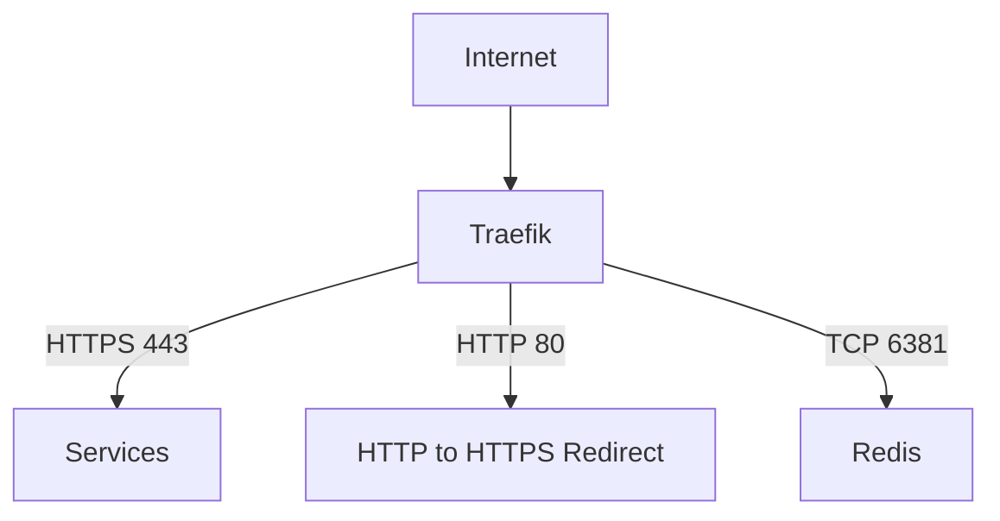
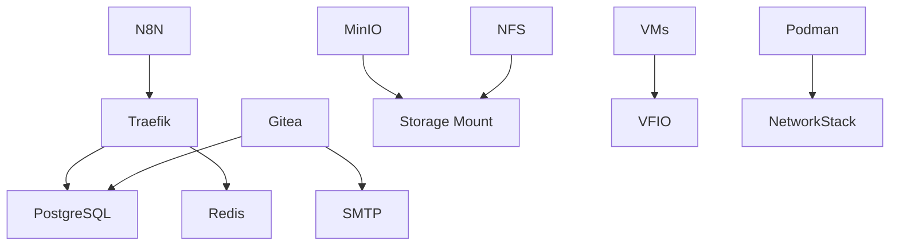

# Service Architecture

## Overview
This document details the service architecture of the LuxNix system, covering virtualization, container management, storage, development tools, and infrastructure services.

## Useful commands

For a comprehensive service status run:
```
bash
systemctl status
```


To see just the active services (without devices):
```
bash
systemctl list-units --type=service --state=active
```


For LuxNix-specific services:

```
bash
systemctl list-units '*luxnix*' --all
```
For system services (add your own):
```
bash
systemctl status \
  sops.service \
  traefik.service \
  podman.service \
  postgresql.service \
  redis.service \
  minio.service
```


## Core Services

### Reverse Proxy (Traefik)


#### Configuration
- TLS termination with Let's Encrypt
- Automatic HTTP to HTTPS redirection
- Domain: endo-reg.net
- Logging:
  - JSON format
  - Access logs with filtering
  - Prometheus metrics integration

### Storage Services

#### MinIO Object Storage
- Port: 9055 (API), 9056 (Console)
- Data directory: `/mnt/share/minio`
- Traefik integration for HTTPS access
- User permissions: media group access

#### NFS/SMB Integration
- Mount point: `/mnt/share`
- Secure credentials management via SOPS
- Automount configuration with timeout settings
- File permissions:
  - Files: 0664
  - Directories: 0775

### Development Infrastructure

#### Gitea
- Custom theme: Catppuccin
- PostgreSQL backend
- SMTP integration for notifications
- Backup configuration:
  - Location: `/mnt/share/gitea/backups`
  - Format: tar.zst

#### PostgreSQL
- Version: 16 with JIT
- Vector search support (pgvecto-rs)
- Automated backups:
  - Location: `/mnt/share/postgresql`
  - Schedule: Daily at 10:00
  - Full database backup

#### Redis
- Port: 6380
- Debug logging enabled
- TCP routing through Traefik
- Exposed for network access

### Automation

#### N8N
- Web interface accessible through Traefik
- Default port: 5678
- Secure HTTPS access

### Virtualization Stack

#### KVM
- Features:
  - SPICE USB redirection
  - TPM support
  - OVMF/UEFI support
- Management tools:
  - virt-manager
  - virt-viewer
  - libguestfs

#### VFIO Passthrough
- IOMMU support for Intel/AMD
- Device isolation capabilities
- Hugepages support:
  - Configurable page size
  - Boot-time allocation
- Looking Glass integration

#### Podman
- Docker compatibility layer
- Socket activation
- DNS enabled for default network
- Rootless container support

## Security Considerations

### Access Control
- TLS termination at Traefik
- Service-specific authentication
- SOPS integration for secrets

### Network Security
- Automatic HTTPS redirection
- Isolated service networks
- Secure credential storage

### Virtualization Security
- IOMMU isolation
- Device ACL management
- TPM support for VMs

## Deployment Guidelines

### Prerequisites
1. Configure SOPS encryption
2. Set up storage mounts
3. Configure network access
4. Prepare virtualization host

### Service Deployment Order
1. Storage services (NFS, MinIO)
2. Database services (PostgreSQL, Redis)
3. Development services (Gitea)
4. Automation services (N8N)
5. Virtualization stack

## Service Dependencies



## Monitoring and Maintenance

### Backup Procedures
- Gitea: Configurable backup schedule
- PostgreSQL: Daily backups
- User data: Through NFS/SMB mounts

### Health Checks
- Traefik metrics endpoint
- Service-specific health monitoring
- Automated backup verification

## Configuration Management

### Secrets Management
- SOPS integration
- Secure credential storage
- Service-specific secret files

### Network Configuration
- Traefik as primary ingress
- Internal service communication
- External access control

## Best Practices

### Deployment
1. Verify secrets configuration
2. Test service connectivity
3. Validate backup procedures
4. Monitor service logs

### Maintenance
1. Regular backup verification
2. Certificate renewal monitoring
3. Storage capacity management
4. Service update procedures

## Troubleshooting

### Common Issues

1. Service Access
   - Check Traefik routing
   - Verify TLS certificates
   - Validate service status

2. Storage
   - Verify mount points
   - Check permissions
   - Monitor capacity

3. Virtualization
   - IOMMU grouping
   - Device passthrough
   - Resource allocation

4. Container Management
   - Network connectivity
   - Storage access
   - Resource constraints