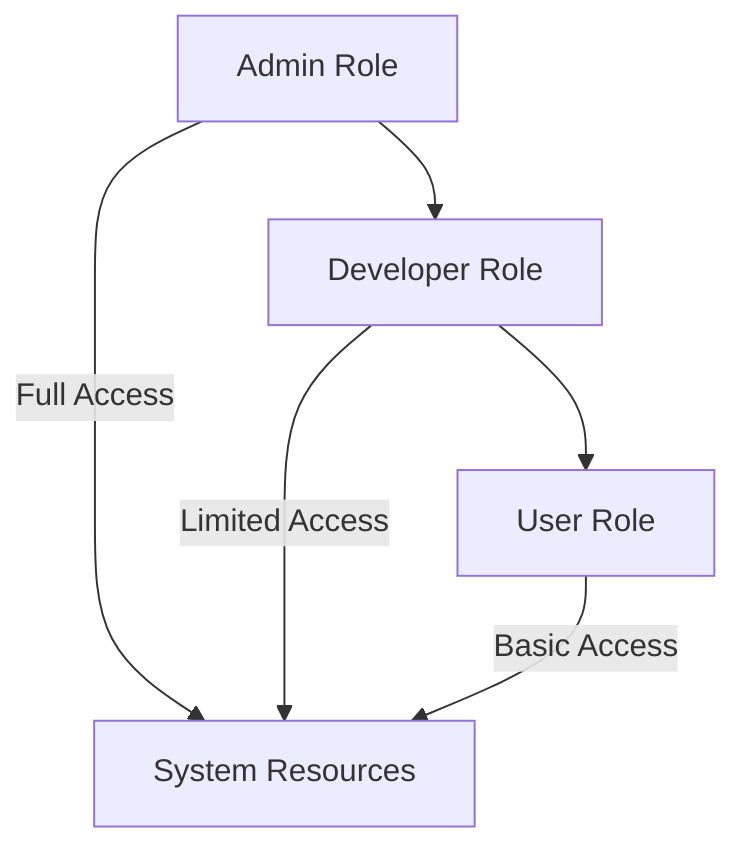

# User Roles

## Overview
The LuxNix system implements a hierarchical role-based access control system with three primary user types: admin, dev-01, and user. Each role has specific permissions and use cases designed for different operational needs.

### Roles vs Users
In the LuxNix system, there's an important distinction between roles and users. Roles, defined in `modules/nixos/roles/` and `modules/home/roles/`, are reusable bundles of functionality and permissions that define what can be done on the system. Users, on the other hand, are actual accounts that are assigned these roles and represent who can perform these actions. For example, while the admin role defines administrative capabilities and permissions, an admin user (like `admin@gc-02`) is a specific account that inherits these capabilities on a specific machine. This separation allows for flexible and maintainable configuration where capabilities (roles) can be defined once and assigned to multiple users across different machines, while still maintaining distinct user identities and machine-specific configurations.

## Role Types

### Admin Role
```nix
user.admin = {
    name = "admin";
    initialPassword = "1";
};
```

#### Responsibilities
- System administration
- Service deployment
- Security management
- Infrastructure maintenance

#### Permissions
- Full system access
- Sudo privileges
- Service management
- Configuration changes
- Network administration

### Developer Role (dev-01)
```nix
dev-01 = {
    name = "dev-01";
    initialPassword = "1";
};
```

#### Responsibilities
- Development work
- Testing
- Local service management
- Development environment maintenance

#### Permissions
- Development tool access
- Container management
- Local service deployment
- Development environment configuration

### Standard User Role
```nix
user = {
    enable = true;
    name = "user";
    initialPassword = "1";
};
```

#### Responsibilities
- Regular system usage
- Running applications
- Personal workspace management

#### Permissions
- Limited system access
- Application execution
- Personal directory management
- Basic system utilities

## Role Configuration

### Home Directory Structure
```
homes/
└── x86_64-linux/
    ├── admin@[hostname]/
    ├── dev-01@[hostname]/
    └── user@[hostname]/
```

### Per-Role Settings

#### Admin Settings
- Full system configuration access
- Service management capabilities
- Backup and restore privileges
- Network configuration access

#### Developer Settings
- Development tool configurations
- Container runtime access
- Build tool access
- Testing environment privileges

#### User Settings
- Desktop environment configuration
- Personal application settings
- Basic system utilities access

## Security Considerations

### Password Management
- Initial passwords must be changed on first login
- Password policies enforced
- Optional SOPS integration for secret management

### Access Control
- Role-based file permissions
- Service access restrictions
- Network access controls
- Sudo privilege management

## Role Inheritance



## Implementation Guidelines

### Creating New Users
1. Define user in appropriate role configuration
2. Set initial password
3. Configure home directory
4. Apply role-specific settings
5. Set up access permissions

### Modifying Existing Roles
1. Update role configuration
2. Modify permission sets
3. Update service access
4. Regenerate configurations
5. Deploy changes

## Best Practices

### Security
- Regular password rotation
- Principle of least privilege
- Regular permission audits
- Access log monitoring

### Management
- Document role changes
- Regular permission reviews
- Clear role documentation
- Standardized onboarding process

### Maintenance
- Regular role audits
- Permission verification
- Access control updates
- Security policy reviews

## Troubleshooting

### Common Issues
1. Permission Problems
   - Verify role configuration
   - Check file permissions
   - Validate service access
   - Review sudo rules

2. Access Denied
   - Confirm role assignment
   - Check group membership
   - Verify service permissions
   - Review access logs

3. Configuration Issues
   - Validate role definitions
   - Check inheritance
   - Verify deployment
   - Review system logs

## Configuration Examples

### Admin Role Configuration
```nix
{
    config.roles.admin = {
        enable = true;
        extraGroups = ["wheel" "networkmanager"];
        allowedServices = ["all"];
    };
}
```

### Developer Role Configuration
```nix
{
    config.roles.dev-01 = {
        enable = true;
        extraGroups = ["docker" "podman"];
        allowedServices = ["development"];
    };
}
```

### User Role Configuration
```nix
{
    config.roles.user = {
        enable = true;
        extraGroups = ["users"];
        allowedServices = ["basic"];
    };
}
```